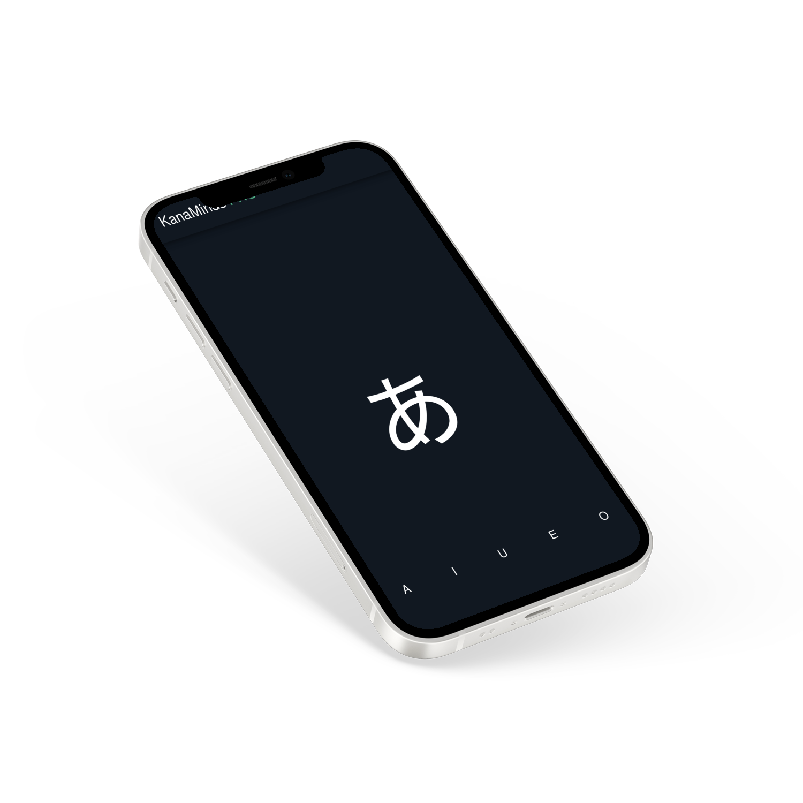

# KanaMinds Pro



## Overview

Welcome to KanaMinds Pro, a cross-platform language learning app designed to help users master hiragana and katakana characters in the Japanese writing system. Built with React Native, this app provides a seamless experience on both Android and iOS platforms, offering a user-friendly interface and engaging exercises to make the learning process enjoyable.

## Features

- **Cross-Platform Compatibility:** KanaMinds Pro works smoothly on both Android and iOS devices, ensuring accessibility for a wide range of users.

- **Interactive Learning:** The app includes engaging exercises that make the process of learning hiragana and katakana characters dynamic and fun.

- **User-Friendly Interface:** With a clean and intuitive design, KanaMinds Pro offers a hassle-free learning experience for users of all levels.

## Getting Started

To get started with KanaMinds Pro, follow these simple steps:

1. **Clone the Repository:**
   - Open your terminal and run the following command to clone the KanaMinds Pro repository to your local machine:
     ```bash
     git clone https://github.com/dreamxinxcode/KanaMinds-Pro.git
     ```

2. **Navigate to the Project Directory:**
   - Change into the project directory using the following command:
     ```bash
     cd KanaMinds-Pro
     ```

3. **Install Dependencies:**
   - Install the project dependencies by running:
     ```bash
     npm install
     ```

4. **Run the App Locally:**
   - Start the local development server with the following command:
     ```bash
     npm start
     ```
   This will launch the KanaMinds Pro app locally.

5. **Open in Browser:**
   - Open your web browser and navigate to [http://localhost:8081](http://localhost:8081) to access the KanaMinds Pro app.


<!-- 1. **Download and Install:**
   - For Android: [Google Play Store Link](https://play.google.com/store/apps/kanamindspro)
   - For iOS: [App Store Link](https://apps.apple.com/kanamindspro)

2. **Open the App:**
   - Launch KanaMinds Pro on your device.

3. **Start Learning:**
   - Explore the interactive exercises and quizzes to enhance your knowledge of hiragana and katakana characters. -->

## Contributing

Contributions to enhance KanaMinds Pro and make it an even more effective language learning tool are welcome! If you're interested in contributing, please feel free to reach out!

## Support and Feedback

If you encounter any issues or have feedback to share, please reach out to me at [brandon@dreamincode.dev](mailto:brandon@dreamincode.dev).

Happy learning with KanaMinds Pro!